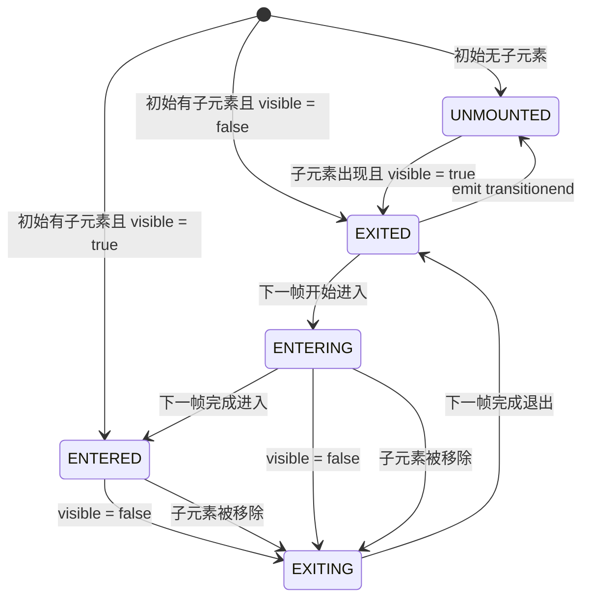

# {{ $frontmatter.title }}

为内容的显示与隐藏（或创建与销毁）施加过渡效果。

> [!NOTE]
> 仅支持包裹单个组件或元素

## 显示与隐藏

::: react-live
```tsx
import { useState } from 'react';
import { Switch, Transition } from '@nild/components';
import { DynamicIcon } from '@nild/icons';

const Demo = () => {
  const [checked, setChecked] = useState(true);

  return (
    <div className="flex flex-col items-start gap-4">
      <Switch checked={checked} onChange={setChecked}>
        <Switch.Track type="checked">Visible</Switch.Track>
        <Switch.Track type="unchecked">Invisible</Switch.Track>
      </Switch>
      <Transition className="duration-600" visible={checked}>
        <DynamicIcon name="ghost" className="text-2xl" />
      </Transition>
    </div>
  );
};

render(<Demo />);
```
:::

## 创建与销毁

::: react-live
```tsx
import { useState } from 'react';
import { Switch, Transition } from '@nild/components';
import { DynamicIcon } from '@nild/icons';

const Demo = () => {
  const [checked, setChecked] = useState(true);

  return (
    <div className="flex flex-col items-start gap-4">
      <Switch checked={checked} onChange={setChecked}>
        <Switch.Track type="checked">Create</Switch.Track>
        <Switch.Track type="unchecked">Destroy</Switch.Track>
      </Switch>
      <Transition className="duration-600">
        {checked && <DynamicIcon name="skull" className="text-2xl" />}
      </Transition>
    </div>
  );
};

render(<Demo />);
```
:::

## 自定义过渡

::: react-live
```tsx
import { useState } from 'react';
import { cnJoin } from '@nild/shared';
import { Switch, Transition, TransitionStatus } from '@nild/components';

const Demo = () => {
  const [visible, setVisible] = useState(false);

  return (
    <div className="flex flex-col items-start gap-4">
      <Switch checked={visible} onChange={setVisible}>
        <Switch.Track type="checked">Show</Switch.Track>
        <Switch.Track type="unchecked">Hide</Switch.Track>
      </Switch>
      <Transition visible={visible}>
        {status => {
          const entered = status === TransitionStatus.ENTERED;
          return (
            <div
              className={cnJoin([
                'transition-[opacity,translate] duration-600',
                entered ? 'translate-y-0 opacity-100' : '-translate-y-2 opacity-0',
              ])}
            >
              {entered ? 'Fall down' : 'Rise'}
            </div>
          );
        }}
      </Transition>
    </div>
  );
};

render(<Demo />);
```
:::

## 状态机

`Transition` 会同时根据 `visible` 和 “子元素是否仍然存在” 来决定当前状态：

- 当子元素存在时，`visible` 用来驱动 `EXITED -> ENTERING -> ENTERED` 和 `ENTERED -> EXITING -> EXITED`
- 当子元素被移除时，会先保留/缓存子元素以播放退出流程，完成后再在根节点触发 `transitionend`，最终进入 `UNMOUNTED`



> [!NOTE]
> `EXITED` 表示 “仍保留在 DOM 中，但处于退出后的隐藏状态”，而 `UNMOUNTED` 才代表节点已被真正卸载。

## API

<!--@include: ../../../../packages/components/src/transition/API.zh-CN.md-->
