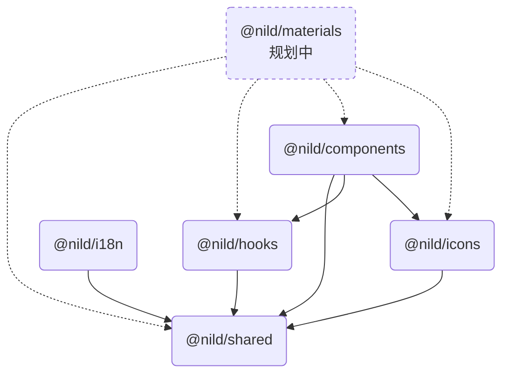

# {{ $frontmatter.title }}

本页聚焦包边界、依赖方向和第三方依赖。安装命令见 [快速开始](./quick-start.md)，主题接入见 [样式与动态主题](./style-and-theme.md)。

## 包边界

| 包名 | 定位 | 状态 |
| - | - | - |
| `@nild/shared` | 类型、工具函数、React 基础能力与 class 合并工具。 | ✅ 可用 |
| `@nild/hooks` | React Hooks。 | ✅ 可用 |
| `@nild/icons` | 图标渲染与动态图标能力。 | ✅ 可用 |
| `@nild/i18n` | 国际化实例、插值插件与类型。 | ✅ 可用 |
| `@nild/components` | React 组件与组件样式入口。 | ✅ 可用 |
| `@nild/materials` | 规划中的高层物料包。 | 🚧 规划中 |

## 依赖关系

箭头方向表示“当前包依赖目标包”。`@nild/materials` 使用虚线表示规划链路，不代表当前可导入能力。

## 第三方依赖

| 名称 | 版本 | Used By |
| - | - | - |
| [`@floating-ui/dom`](https://www.npmjs.com/package/@floating-ui/dom/v/1.7.1) | `1.7.1` | `@nild/components` |
| [`@icon-park/react`](https://www.npmjs.com/package/@icon-park/react/v/1.4.2) | `1.4.2` | `@nild/icons` |
| [`culori`](https://www.npmjs.com/package/culori/v/4.0.2) | `^4.0.2` | `@nild/components` |
| [`tailwind-merge`](https://www.npmjs.com/package/tailwind-merge/v/3.3.0) | `3.3.0` | `@nild/shared` |

## Peer Dependencies

| 名称 | 版本 | Needed By |
| - | - | - |
| [`lodash-es`](https://www.npmjs.com/package/lodash-es) | `^4.17.21` | `@nild/shared` |
| [`react`](https://www.npmjs.com/package/react) | `^18.2.0` | `@nild/shared`、`@nild/hooks`、`@nild/icons`、`@nild/components` |
| [`react-dom`](https://www.npmjs.com/package/react-dom) | `^18.2.0` | `@nild/components` |
| [`tailwindcss`](https://www.npmjs.com/package/tailwindcss) | `^4.1.7` | `@nild/shared` |
