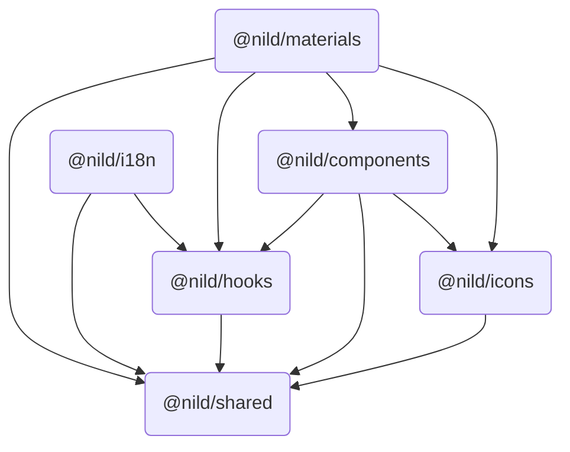

# 快速开始 <Badge type="warning" text="WIP" />

## 简介

Nil Design 为提供一站式的开发体验，共实现了六个包，它们的名称及关系依赖如下图所示：



## 第三方依赖

### Dependencies

| 名称 | 版本 | Used By |
| - | - | - |
| [@floating-ui/dom](https://www.npmjs.com/package/@floating-ui/dom/v/1.7.1) | 1.7.1 | @nild/components |
| [@icon-park/react](https://www.npmjs.com/package/@icon-park/react/v/1.4.2) | 1.4.2 | @nild/icons |
| [tailwind-merge](https://www.npmjs.com/package/tailwind-merge/v/3.3.0) | 3.3.0 | @nild/shared |

### Peer Dependencies

| 名称 | 版本 | Needed By |
| - | - | - |
| [lodash-es](https://www.npmjs.com/package/lodash-es) | ^4.17.21 | @nild/shared |
| [react](https://www.npmjs.com/package/react) | ^18.2.0 | @nild/shared<br>@nild/i18n<br>@nild/hooks<br>@nild/icons<br>@nild/components<br>@nild/materials |
| [react-dom](https://www.npmjs.com/package/react-dom) | ^18.2.0 | @nild/components<br>@nild/materials |
| [tailwindcss](https://www.npmjs.com/package/tailwindcss) | ^4.1.7 | @nild/shared |

## 安装

> [!NOTE]
> PNPM 安装前建议设置 `auto-install-peers=true`

::: code-group
```sh [NPM]
npm install @nild/shared
npm install @nild/hooks
npm install @nild/i18n
npm install @nild/icons
npm install @nild/components
npm install @nild/materials
```
```sh [PNPM]
pnpm add @nild/shared
pnpm add @nild/hooks
pnpm add @nild/i18n
pnpm add @nild/icons
pnpm add @nild/components
pnpm add @nild/materials
```
:::
