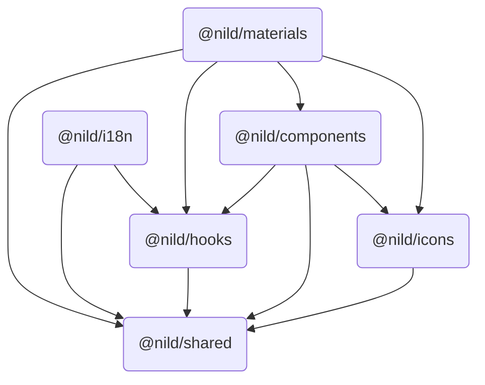

# 快速开始 <Badge type="warning" text="WIP" />

## 简介

Nil Design 为提供一站式的开发体验，共实现了六个包，它们的名称及关系依赖如下图所示：



## 依赖全览

### Dependencies

| 名称 | 版本 |
| - | - |
| [tailwind-merge](https://www.npmjs.com/package/tailwind-merge/v/3.3.0) | 3.3.0 |
| [@icon-park/react](https://www.npmjs.com/package/@icon-park/react/v/1.4.2) | 1.4.2 |
| [@floating-ui/dom](https://www.npmjs.com/package/@floating-ui/dom/v/1.7.1) | 1.7.1 |

### Peer Dependencies

| 名称 | 版本 |
| - | - |
| [lodash-es](https://www.npmjs.com/package/lodash-es) | ^4.17.21 |
| [react](https://www.npmjs.com/package/react) | ^18.2.0 |
| [react-dom](https://www.npmjs.com/package/react-dom) | ^18.2.0 |
| [tailwindcss](https://www.npmjs.com/package/tailwindcss) | ^4.1.7 |

## 如何使用

### 安装

> [!NOTE]
> PNPM 安装前建议设置 `auto-install-peers=true`

::: code-group
```sh [NPM]
npm install @nild/shared
npm install @nild/hooks
npm install @nild/i18n
npm install @nild/icons
npm install @nild/components
npm install @nild/materials
```
```sh [PNPM]
pnpm add @nild/shared
pnpm add @nild/hooks
pnpm add @nild/i18n
pnpm add @nild/icons
pnpm add @nild/components
pnpm add @nild/materials
```
:::

### @nild/components

开箱即用的组件包。

##### 引入样式

组件包并没有选择导出最终样式，而是导出了一份 tailwind 主题以供再定制；可通过 `@source` 指令来显式指定 tailwind 检测包内组件代码，与您的业务代码一起进行样式构建：

```css{2,4}
@import 'tailwindcss';
@import '@nild/components/tailwindcss';
/* other imports ... */
@source '../../../node_modules/@nild/components/dist';
```
