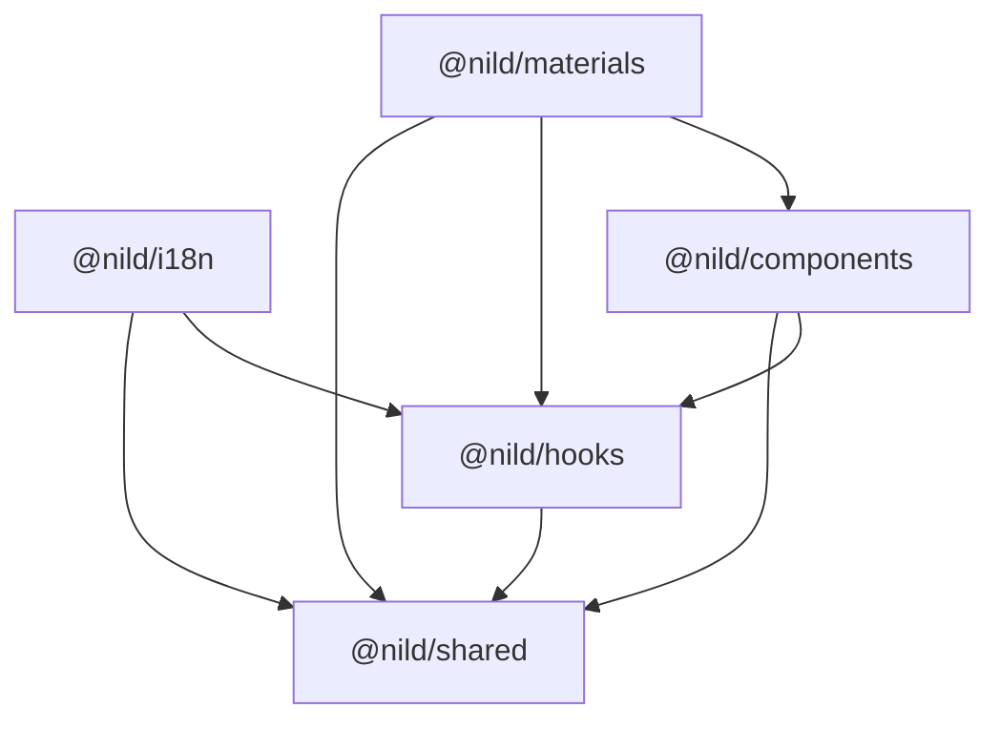

# 快速开始

## 简介

Nil Design 为提供一站式的开发体验，共实现了五个包，它们的名称及关系依赖如下图所示：



## 对等依赖

> [!NOTE]
> PNPM 建议设置 `auto-install-peers=true`

- [lodash-es](https://www.npmjs.com/package/lodash-es): >=4.17.21
- [react](https://www.npmjs.com/package/react): >=18.2.0
- [react-dom](https://www.npmjs.com/package/react-dom): >=18.2.0
- [tailwind-merge](https://www.npmjs.com/package/tailwind-merge): >=3.3.0
- [tailwindcss](https://www.npmjs.com/package/tailwindcss): >=4.0.0

## 安装

::: code-group
```sh [NPM]
npm install @nild/shared
npm install @nild/hooks
npm install @nild/i18n
npm install @nild/components
npm install @nild/materials
```
```sh [PNPM]
pnpm add @nild/shared
pnpm add @nild/hooks
pnpm add @nild/i18n
pnpm add @nild/components
pnpm add @nild/materials
```
:::